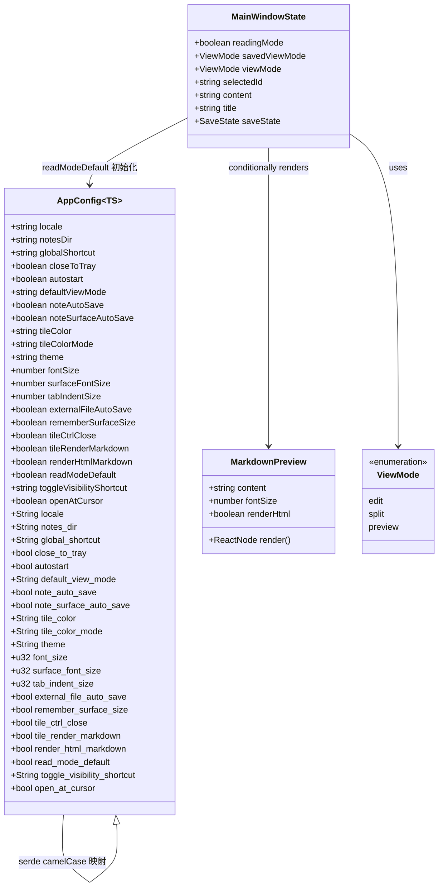
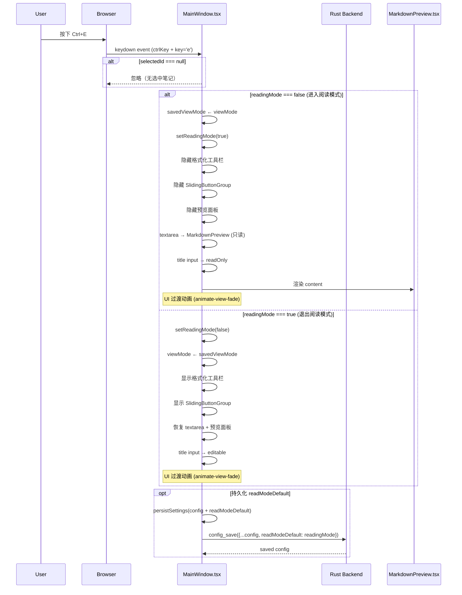
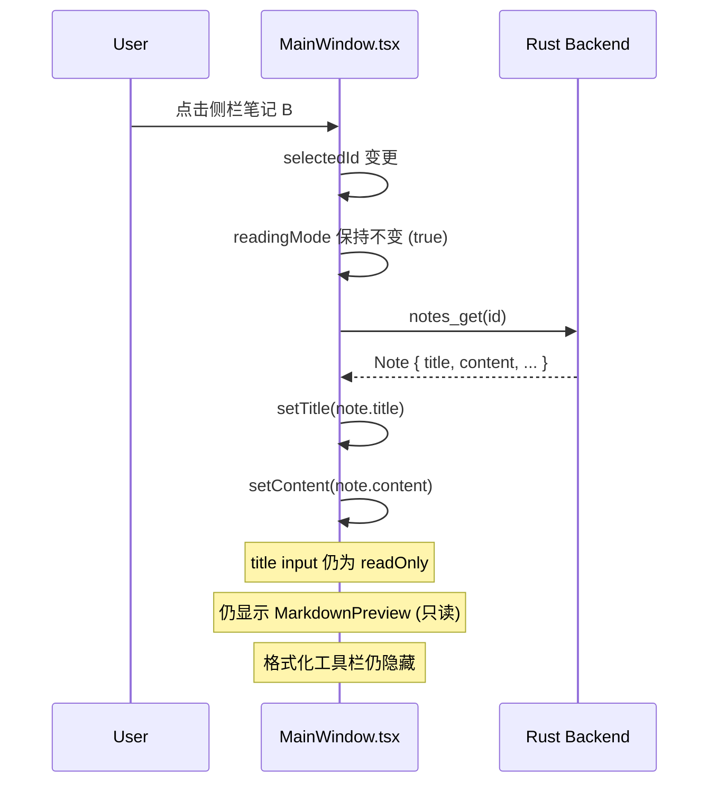
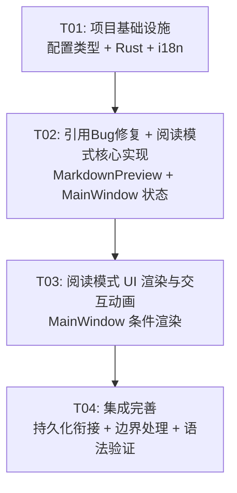

# 花笺 v1.0.6 系统设计文档

> Architect: Bob (高见远) | Date: 2026-01-28

---

## Part A: 系统设计

### 1. 实现方案

#### 1.1 引用 Bug 修复（P0-1, P0-2）

**核心问题**：`react-markdown` + `remark-gfm` 按 CommonMark 规范解析引用。连续的 `> line1\n> line2` 在 AST 中为单一段落节点，浏览器渲染时软换行被合并为空格。

**修复方案（方案 A）**：

采用纯 CSS 方案，不引入额外的 remark 插件：

- 在 `MarkdownPreview.tsx` 的 `blockquote` 自定义组件中，通过 Tailwind CSS arbitrary variant `[&_p]:whitespace-pre-line` 使 blockquote 内所有 `<p>` 子元素保留换行符。
- `whitespace-pre-line` 的特性：保留源代码中的换行符，合并连续空格，允许正常换行（word-wrap）。
- 此方案对正常单段落引用无副作用（无多余换行时不产生额外空白）。

**副作用评估**：

- ✅ 单行引用：无影响
- ✅ 多段落引用（空 `>` 行分隔）：remark-gfm 已正确生成多个 `<p>`，CSS 不改变此行为
- ✅ 嵌套引用（`>>`）：remark-gfm 已正确生成嵌套 `<blockquote>`，CSS 级联生效
- ✅ 引用内含代码块/列表：不影响

**注意**：`remark-gfm` 已支持 autolink 扩展，自动链接（P1-5）无需额外配置。

#### 1.2 阅读模式架构设计

**状态管理**：

```
readingMode: boolean          // 全局运行时状态，切换笔记不变
savedViewMode: ViewMode       // 进入阅读模式前的 viewMode，退出时恢复
```

**初始化**：`readingMode` 从 `AppConfig.readModeDefault` 初始化（启动/首次加载配置时）。

**组件切换策略**（readMode 优先级高于 viewMode）：

| readingMode | 之前的 viewMode | 行为                                                                                               |
| ----------- | --------------- | -------------------------------------------------------------------------------------------------- |
| `false`     | `edit`          | 显示 textarea + 格式化工具栏 + SlidingButtonGroup，无预览面板                                      |
| `false`     | `split`         | 显示 textarea + 格式化工具栏 + SlidingButtonGroup + 预览面板                                       |
| `false`     | `preview`       | 隐藏 textarea/格式化工具栏，显示预览面板                                                           |
| `true`      | 忽略            | 隐藏格式化工具栏 + SlidingButtonGroup，textarae 区替换为 MarkdownPreview（只读），预览面板强制关闭 |

**viewMode/readingMode 交互逻辑**：

```
进入阅读模式（Ctrl+E 或按钮）：
  1. savedViewMode ← currentViewMode
  2. readingMode ← true
  3. viewMode 保持不变（仅用于退出恢复）

退出阅读模式（Ctrl+E 或按钮）：
  1. readingMode ← false
  2. viewMode ← savedViewMode（恢复之前的视图模式）

若用户在编辑模式下手动更改 viewMode（通过 SlidingButtonGroup），
退出阅读模式后使用 savedViewMode，SlidingButtonGroup 重新显示。
```

**Ctrl+E 快捷键**：

- 在 MainWindow.tsx 的 `useEffect` 中添加 `keydown` 监听（与 Ctrl+S 同层级）
- 仅当 `selectedId` 存在时生效
- 不与现有快捷键冲突（Ctrl+S/Ctrl+Z/Ctrl+Y 均保留）

#### 1.3 架构模式

继续使用现有的 **单组件 + Hooks** 模式（MainWindow.tsx 作为主容器），不引入额外的状态管理库。新增状态限于 MainWindow 组件内部。

#### 1.4 框架和库选择

无需新增依赖。所有功能基于现有技术栈实现：

| 功能              | 实现方式                                                 |
| ----------------- | -------------------------------------------------------- |
| 引用换行保留      | Tailwind CSS `[&_p]:whitespace-pre-line`                 |
| 阅读模式动画      | 复用现有 `animate-view-fade` 类                          |
| 快捷键 Ctrl+E     | 浏览器原生 `keydown` 事件                                |
| 状态持久化        | 现有 `config_save`/`config_get` Tauri commands           |
| Markdown 语法验证 | 现有 `remark-gfm` + `rehype-raw` + `rehype-katex` 插件链 |

---

### 2. 修改文件清单

| #   | 文件                                        | 修改类型 | 修改概要                                                                                     |
| --- | ------------------------------------------- | -------- | -------------------------------------------------------------------------------------------- |
| 1   | `src/features/settings/types.ts`            | 新增字段 | `AppConfig` 新增 `readModeDefault: boolean`                                                  |
| 2   | `src-tauri/src/services/notes.rs`           | 新增字段 | `AppConfig` struct 新增 `read_mode_default: bool` + default 函数 + `default_config()` 初始化 |
| 3   | `src/locales/zh-CN/translation.json`        | 新增键   | `main.readingMode.toggle`、`main.readingMode.tooltipEnter`、`main.readingMode.tooltipExit`   |
| 4   | `src/features/markdown/MarkdownPreview.tsx` | 修改组件 | `blockquote` 组件 className 追加 `[&_p]:whitespace-pre-line`                                 |
| 5   | `src/components/MainWindow.tsx`             | 核心修改 | 新增 readingMode/savedViewMode 状态、Ctrl+E 监听、条件渲染逻辑、模式切换按钮                 |
| 6   | `src/features/settings/api.ts`              | 无需修改 | `normalizeViewMode` 与 readModeDefault 无关，AppConfig 类型自动包含新字段                    |

**不需要修改的文件**：

- `src-tauri/src/lib.rs`：Ctrl+E 是应用内快捷键（web 层处理），不需要 Tauri 全局快捷键注册
- `package.json`：无需新增 npm 依赖
- `Cargo.toml`：无需新增 Rust 依赖

---

### 3. 核心数据结构与接口



**TypeScript 新增类型**（`src/features/settings/types.ts`）：

```typescript
// AppConfig 新增字段
export interface AppConfig {
  // ... existing fields ...
  readModeDefault: boolean; // ← NEW: 启动时是否默认进入阅读模式
  // ... existing fields ...
}
```

**Rust 新增字段**（`src-tauri/src/services/notes.rs`）：

```rust
pub struct AppConfig {
    // ... existing fields ...
    #[serde(default = "default_read_mode_default")]
    pub read_mode_default: bool,   // ← NEW
    // ... existing fields ...
}

fn default_read_mode_default() -> bool { false }

// default_config() 中新增：
// read_mode_default: false,
```

**MainWindow readingMode 相关状态设计**：

```typescript
// 在 MainWindow 组件中新增：
const [readingMode, setReadingMode] = useState<boolean>(initialConfig?.readModeDefault ?? false);
const [savedViewMode, setSavedViewMode] = useState<ViewMode>(
  normalizeViewMode(initialConfig?.defaultViewMode ?? "split"),
);
```

---

### 4. 程序调用流程

#### 4.1 用户按 Ctrl+E 切换阅读模式



#### 4.2 阅读模式下切换笔记



---

### 5. 待明确事项

| #   | 事项                                                     | 假设                                                                                                   | 风险                                                                                     |
| --- | -------------------------------------------------------- | ------------------------------------------------------------------------------------------------------ | ---------------------------------------------------------------------------------------- |
| 1   | `readModeDefault` 是否需要在设置面板中提供 UI 切换？     | 当前设计**不提供**设置面板UI，仅记录运行时状态。用户通过 Ctrl+E 切换后会持久化                         | 若后续需要设置面板入口，需在 SettingsPanel.tsx 增加选项                                  |
| 2   | `[&_p]:whitespace-pre-line` 在 Tailwind CSS 4 中的兼容性 | Tailwind v4 支持任意变体选择器，`[&_p]` 语法可用                                                       | 若构建报错，改用 global CSS 规则 `.markdown-blockquote p { white-space: pre-line }`      |
| 3   | `config_save` 去抖 300ms 可能丢失最后状态                | 与现有 `persistSettings` 机制一致，关闭窗口时最后一次切换可被 saveCurrentNote 逻辑覆盖                 | 若用户在 300ms 内关闭窗口，阅读模式状态可能未持久化。可考虑在 close handler 中 flush     |
| 4   | 阅读模式下用户按 Ctrl+S 是否需特殊处理                   | 阅读模式下内容不可编辑，Ctrl+S 应为 no-op                                                              | 现有 Ctrl+S handler 检查 saveState !== "dirty"，阅读模式下 saveState = "saved"，自然跳过 |
| 5   | `savedViewMode` 的初始化时机                             | 仅在首次进入阅读模式时设置。若用户从未进入阅读模式，savedViewMode 保持其初始值（来自 defaultViewMode） | 无风险                                                                                   |

---

## Part B: 任务分解

### 6. 依赖包

**无需新增依赖**。所有 npm/cargo 依赖已在现有项目中满足。

---

### 7. 任务列表

| ID  | 任务名称                                            | 源文件                                                                                                    | 依赖 | 优先级 |
| --- | --------------------------------------------------- | --------------------------------------------------------------------------------------------------------- | ---- | ------ |
| T01 | 项目基础设施：配置类型 + Rust 后端 + i18n           | `src/features/settings/types.ts`, `src-tauri/src/services/notes.rs`, `src/locales/zh-CN/translation.json` | 无   | P0     |
| T02 | 引用Bug修复 + 阅读模式核心实现                      | `src/features/markdown/MarkdownPreview.tsx`, `src/components/MainWindow.tsx`                              | T01  | P0     |
| T03 | 阅读模式 UI 渲染与交互动画                          | `src/components/MainWindow.tsx`                                                                           | T02  | P0     |
| T04 | 集成完善：持久化衔接 + 边界处理 + Markdown 语法验证 | `src/components/MainWindow.tsx`, `src-tauri/src/services/notes.rs`                                        | T03  | P1     |

#### 详细任务说明

**T01: 项目基础设施：配置类型 + Rust 后端 + i18n**

| 文件                                 | 修改内容                                                                                                                                                                                                                             |
| ------------------------------------ | ------------------------------------------------------------------------------------------------------------------------------------------------------------------------------------------------------------------------------------ |
| `src/features/settings/types.ts`     | 在 `AppConfig` 接口中新增 `readModeDefault: boolean` 字段                                                                                                                                                                            |
| `src-tauri/src/services/notes.rs`    | 在 `AppConfig` struct 中新增 `read_mode_default: bool` 字段（含 `#[serde(default)]`），新增 `default_read_mode_default()` 返回 `false`，在 `default_config()` 中添加 `read_mode_default: false`，在 `config_save` 方法中保持字段透传 |
| `src/locales/zh-CN/translation.json` | 在 `main` 下新增 `readingMode` 对象，含 `toggle`、`tooltipEnter`、`tooltipExit` 三个 i18n 键                                                                                                                                         |

**T02: 引用Bug修复 + 阅读模式核心实现**

| 文件                                        | 修改内容                                                                                                                                                                                                                                                                                             |
| ------------------------------------------- | ---------------------------------------------------------------------------------------------------------------------------------------------------------------------------------------------------------------------------------------------------------------------------------------------------- |
| `src/features/markdown/MarkdownPreview.tsx` | 修改 `blockquote` 组件（line 103-107），className 追加 ` [&_p]:whitespace-pre-line`，使 blockquote 内 `<p>` 保留换行                                                                                                                                                                                 |
| `src/components/MainWindow.tsx`             | (1) 导入 `readingMode` 新增状态 `readingMode`（初始值 `initialConfig?.readModeDefault ?? false`）和 `savedViewMode`；(2) 新增 `useEffect` 监听 Ctrl+E 快捷键（与 Ctrl+S 同层级）；(3) 新增 `handleToggleReadingMode` 回调函数：进入时保存 viewMode 并设置 readingMode=true，退出时恢复 savedViewMode |

**T03: 阅读模式 UI 渲染与交互动画**

| 文件                            | 修改内容                                                                                                                                                                                                                                                                                                                                                                                                 |
| ------------------------------- | -------------------------------------------------------------------------------------------------------------------------------------------------------------------------------------------------------------------------------------------------------------------------------------------------------------------------------------------------------------------------------------------------------- |
| `src/components/MainWindow.tsx` | (1) 工具栏区：readingMode=true 时隐藏格式化工具栏按钮行、隐藏 SlidingButtonGroup，在 SlidingButtonGroup 左侧新增阅读模式切换按钮（📖/✏️ 图标 + tooltip）；(2) 标题区：readingMode=true 时 title input 设为 `readOnly`；(3) 内容区：readingMode=true 时，不论 viewMode，text area 区域替换为 `<MarkdownPreview content={content} ... />`，预览面板强制隐藏；(4) 使用现有 `animate-view-fade` 实现切换动画 |

**T04: 集成完善：持久化衔接 + 边界处理 + Markdown 语法验证**

| 文件                              | 修改内容                                                                                                                                                                                                             |
| --------------------------------- | -------------------------------------------------------------------------------------------------------------------------------------------------------------------------------------------------------------------- |
| `src/components/MainWindow.tsx`   | (1) 在 `persistSettings` 中确保 `readModeDefault: readingMode` 随其他配置一起持久化；(2) 边界处理：无选中笔记时 Ctrl+E 忽略、切换笔记保持 readingMode 不变；(3) 阅读模式下 Ctrl+S 自然跳过（saveState 保持 "saved"） |
| `src-tauri/src/services/notes.rs` | 验证 `config_save`/`load_config` 对新字段 `read_mode_default` 的正确序列化/反序列化（现有 `#[serde(default)]` + default function 已保证向后兼容）                                                                    |
| 验证清单                          | 逐一验证 Markdown 语法（P1-1 至 P1-8）：两空格换行、缩进代码块、语言标注、引用式链接、自动链接、图片、分隔线、转义字符 — 均为构建时确认，不修改代码                                                                  |

---

### 8. 共享知识

```
# 命名规范
- TypeScript: readModeDefault (camelCase)
- Rust/serde: read_mode_default (snake_case, #[serde(rename_all = "camelCase")] 自动转换)
- i18n key: main.readingMode.toggle, main.readingMode.tooltipEnter, main.readingMode.tooltipExit

# CSS 约定
- 复用 animate-view-fade 动画类（已在全局 CSS 定义）
- blockquote 换行修复使用 Tailwind arbitrary variant: [&_p]:whitespace-pre-line
- 阅读模式切换按钮样式参照现有 SlidingButtonGroup 风格

# 状态转换约定
- readingMode 优先级 > viewMode（阅读模式忽略 viewMode）
- 切换笔记不改变 readingMode（全局状态）
- 仅在首次进入阅读模式时保存 viewMode，退出时恢复

# Tauri 命令
- config_get / config_save: 已存在，无需新增
- Ctrl+E 在 web 层处理（keydown event），不注册全局快捷键

# 错误处理
- 阅读模式切换为纯前端操作，不涉及异步调用
- config_save 失败时静默降级（状态不持久化但不影响功能）
- 现有 errorMessage 机制不适用（切换无失败场景）
```

---

### 9. 任务依赖图


